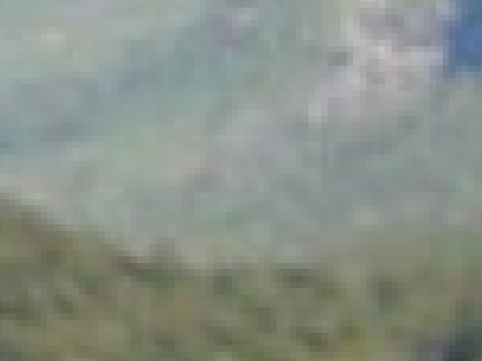
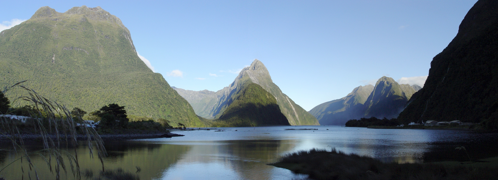

---
layout: slideshow
title: Introduction to Programming with Python
slides:

    - content: |
        ## How are images stored?
        Vector and raster graphics

      notes: |
        It's important that you have a basic understanding of how images are stored

    - content: |
        ## Raster graphics
        {:height="240"}
        {:height="240"}
      notes: |
        We see an example of a raster graphic every time we see a photo
        alpha channel. 

        When we look at the picture of the Milford sound on the slide, and keep zooming in, you can start to distinguish the individual pixels.

        There is quite a large amount of data in a photo or raster image.

        compression

    - content: | 
        ## Bit depth/Colour depth
        {:height="240"}
        {:height="240"}

      notes: |
        A important quality of raster images is the bit depth. The bit depth or colour depth is the number of bits used to indicate level of colour for each colour in a pixel.  

        With each bit having a value of one or zero, we can work out the number of shades available by taking two to the power of the bit depth. So two 2 has 4 shades available and 8 bits has 256 shades.       

        As the bit depth of the image increases so does the richness of the colour palette of an image. Looking at the image on the slide, you can see an how the picture looks richer and smoother as the colour depth goes up.     

        As a point of reference, a typical jpeg file has a colour depth of 8 buts, but some high end systems will to go 30 bits per channel or higher.

    - content: |
        ## File formats
        + Compressed and uncompressed formats i.e JPEG and PNG
        + Image fidelity vital -> don't compress
        + Intermediate workflow -> don't compress 
          
      notes: |

        Once you have created an image of some sort, an important consideration is what format should you save it in?

        Perhaps the main question to ask is, do I want a perfect rendition of the image I have created? There are two categories of image formats, lossy and lossless. 

        Jpeg is a good example of a lossy format. When you save something in jpeg, you will permanently lose some of the information as it tries to make the image file smaller. A lossless format can try and compress the file size down but not at the cost of the loss of information. PNG is a good example of a lossless format.

        The picture on the slide of the cat shows how the level of compression (and distortion) can vary. The left hand side of the picture is very heavily compressed, and the right hand side has very little compression. You can see how the image quality increases as the level of compression decreases.

        JPEG is good with smooth changes in colour, rapid changes, such as lines on a graph, can lead to ugly artefacts. JPEG is good at compressing "natural" images such as photos of landscapes.  

        To put all this in the context of you scientific workflow:
        If you want perfect reproduction of an image (or as close to as possible) save images in a lossless format.

        IF you are compressing image files, wait until the end of your workflow to do so. Compress once. Repeated compression will degrade your image quality.

    - content: |
        ## Vector graphics
        + Polygons rather than pixels
        + Can scale up as small or large as we want -> rasterize
        \

      notes: |
        So we have seen that raster graphics are graphics composed of a grid of pixels. Vector graphics on the other hand are made up of parametrized shapes such polygons and splines. Polygons are shapes that can be created by bounding an area by straight lines, more simply triangle, squares and shapes made by combing them etc. Splines are curves generated from a mathematical expression. 

        The difference between vector and raster graphics becomes clear when we need to scale an image up. Thinking back to what happened when we scaled up the raster image a few slides back, the individual pixels became more and more visible. Likewise the shapes that make up a vector graphic will increase in size, but this doesn't lead to a drop in fidelity. Vector graphics also allow for colour gradients, which means we can smoothly transition from one colour to another, regardless of the scale.

        To display an vector graphic on a screen, it has to be rasterized, screens display images in pixels, so ultimately a vector graphic has to be converted for it to be displayed. 

        In a way, raster graphics are a special case of vector graphics, made up of only coloured squares, without any other shapes. 

    - content: |
        ## Vector graphics in your scientific workflow
        + Illustrations
        + Graphs
      notes: |
        The two types of graphic that you would likely create in a vector graphic form are illustrations and graphs/tables. 

        With graphs the advantage of a vector format is that you can scale them up and down in size without any loss in image quality. The same goes for illustrations. If you are using word to create papers or documents pdf is a convenient format to save in. If using Latex eps will be the most convenient form. Try to save graphs in a vector format where possible.

---